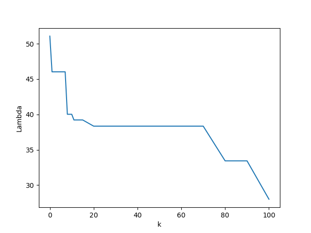
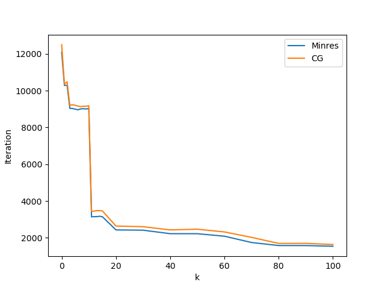

# Matrix-Free-Preconditioner: Math 270C Final Project

In this project, we implemented the matrix-free preconditioner from

`Stefania Bellavia, Jacek Gondzio, and Benedetta Morini. 2013. A matrix-free preconditioner for sparse symmetric positive definite systems and least-squares problems. SIAM Journal on Scientific Computing 35, 1 (2013), A192–A211`

### [[Project Report]](wiki/270C_Final_Project_Report.pdf)


# Build
```bash
mkdir build
cd build
cmake .. -DCMAKE_BUILD_TYPE=Release
make -j12
```
An executable 'preconditioner_test' will be generated under `build/bin`

# Run
Download `system_matrix_random_F.bin` from [this Google Drive](https://drive.google.com/drive/folders/1OHcjV29MGlddUY2DfFa1um68hr65ssMh?usp=sharing) under `data` folder.

```
./build/bin/preconditioner_test
```

This demo will load the above the matrix and solve a linear system where the ground truth solution is a vector whose elements are all 1's. The LMP

# Other Statistics
## Plot of largest eigen value w.r.t. `k`


## Plot of iteration number w.r.t. `k`



